```mermaid
graph TB
    subgraph API_Layer["🔌 FFI API Layer"]
        FFI["FFI Interface<br/>(extern C)<br/>• Expose functions<br/>• C-compatible ABI<br/>• Pointer handling<br/>• Error codes"]
        
        Serializer["Data Serializer<br/>• JSON parsing<br/>• Binary encoding<br/>• Type conversion"]
    end
    
    subgraph Core_Services["🧠 Core Services"]
        WorkoutEngine["Workout Engine<br/>• Generate programs<br/>• Adapt workouts<br/>• Handle skipped sessions<br/>• Time variations"]
        
        ProgressionEngine["Progression Engine<br/>• Progressive overload<br/>• Plateau detection<br/>• Auto-regulation<br/>• Deload scheduling"]
        
        NutritionEngine["Nutrition Engine<br/>• Calculate TDEE<br/>• Macro distribution<br/>• Calorie adjustment<br/>• Weight trends"]
        
        AnalyticsEngine["Analytics Engine<br/>• Progress calculation<br/>• Trend analysis<br/>• Volume tracking<br/>• Intensity metrics"]
    end
    
    subgraph Algorithms["⚙️ Algorithm Components"]
        PeriodicAlgo["Periodization<br/>• Linear periodization<br/>• Undulating periodization<br/>• Block periodization"]
        
        OverloadAlgo["Overload Logic<br/>• Double progression<br/>• Linear progression<br/>• Wave loading"]
        
        RecoveryAlgo["Recovery Logic<br/>• ACWR calculation<br/>• Fatigue monitoring<br/>• Deload triggers"]
        
        PredictAlgo["Prediction Models<br/>• 1RM estimation<br/>• Performance forecast<br/>• Plateau prediction"]
    end
    
    subgraph Data_Models["📊 Domain Models"]
        UserModel["User Model<br/>• Profile data<br/>• Goals<br/>• Experience level<br/>• Preferences"]
        
        WorkoutModel["Workout Model<br/>• Exercise selection<br/>• Sets/reps scheme<br/>• Rest periods<br/>• RPE targets"]
        
        PerformanceModel["Performance Model<br/>• Historical data<br/>• Volume metrics<br/>• Intensity metrics<br/>• RPE logs"]
        
        NutritionModel["Nutrition Model<br/>• TDEE calculation<br/>• Macro targets<br/>• Weight history"]
    end
    
    subgraph Utils["🛠️ Utility Components"]
        MathUtils["Math Utilities<br/>• Statistical functions<br/>• Linear regression<br/>• Moving averages<br/>• Percentile calc"]
        
        DateUtils["Date Utilities<br/>• Training age<br/>• Week calculations<br/>• Cycle management"]
        
        ValidationUtils["Validation<br/>• Input sanitization<br/>• Range checks<br/>• Safety limits"]
    end
    
    subgraph Storage["💾 Data Access"]
        QueryBuilder["Query Builder<br/>• Build SQL queries<br/>• Type-safe queries"]
        
        DataCache["In-Memory Cache<br/>• Recent workouts<br/>• User preferences<br/>• Calculation results"]
    end
    
    MobileApp["📱 Mobile App"] -->|"FFI calls<br/>(C ABI)"| FFI
    
    FFI --> Serializer
    Serializer -->|"Deserialize input"| WorkoutEngine
    Serializer -->|"Deserialize input"| ProgressionEngine
    Serializer -->|"Deserialize input"| NutritionEngine
    Serializer -->|"Deserialize input"| AnalyticsEngine
    
    WorkoutEngine --> PeriodicAlgo
    WorkoutEngine --> OverloadAlgo
    WorkoutEngine -->|"Uses"| UserModel
    WorkoutEngine -->|"Creates"| WorkoutModel
    WorkoutEngine -->|"Checks"| ValidationUtils
    
    ProgressionEngine --> OverloadAlgo
    ProgressionEngine --> RecoveryAlgo
    ProgressionEngine --> PredictAlgo
    ProgressionEngine -->|"Reads"| PerformanceModel
    ProgressionEngine -->|"Uses"| MathUtils
    
    NutritionEngine -->|"Uses"| UserModel
    NutritionEngine -->|"Creates"| NutritionModel
    NutritionEngine -->|"Uses"| MathUtils
    
    AnalyticsEngine -->|"Reads"| PerformanceModel
    AnalyticsEngine --> MathUtils
    AnalyticsEngine --> PredictAlgo
    
    RecoveryAlgo -->|"Analyzes"| PerformanceModel
    PredictAlgo -->|"Uses"| MathUtils
    OverloadAlgo -->|"Uses"| DateUtils
    
    WorkoutEngine -->|"Query data"| QueryBuilder
    ProgressionEngine -->|"Query data"| QueryBuilder
    AnalyticsEngine -->|"Cache results"| DataCache
    
    QueryBuilder -->|"SQL queries"| SQLite["🗄️ SQLite DB"]
    
    WorkoutEngine -->|"Serialize output"| Serializer
    ProgressionEngine -->|"Serialize output"| Serializer
    NutritionEngine -->|"Serialize output"| Serializer
    AnalyticsEngine -->|"Serialize output"| Serializer
    
    Serializer -->|"Return JSON"| FFI
    FFI -->|"Return result"| MobileApp
    
    style API_Layer fill:#E3F2FD,stroke:#1976D2
    style Core_Services fill:#FFF3E0,stroke:#F57C00
    style Algorithms fill:#F3E5F5,stroke:#7B1FA2
    style Data_Models fill:#E8F5E9,stroke:#388E3C
    style Utils fill:#FCE4EC,stroke:#C2185B
    style Storage fill:#FFF9C4,stroke:#F57F17
    
    style FFI fill:#64B5F6,color:#000
    style WorkoutEngine fill:#FFB74D,color:#000
    style OverloadAlgo fill:#BA68C8,color:#fff
    style UserModel fill:#81C784,color:#000
    style MathUtils fill:#F06292,color:#fff
    style QueryBuilder fill:#FFF59D,color:#000
```

# LiftUp-EIP Architecture - C4 Model UML Diagrams

**Document Version:** 1.0  
**Last Updated:** February 23, 2026  
**Modeling Approach:** C4 Model (Context, Containers, Components)  
**Status:** Architecture Design Document

---

## Executive Summary

This document presents the complete architectural design of **LiftUp-EIP**, a mobile fitness coaching application, using the **C4 Model** methodology. The C4 Model provides a hierarchical view of the system architecture at four levels of abstraction:

1. **Level 1 - Context**: How the system fits in the world (users, external systems)
2. **Level 2 - Containers**: High-level technical architecture (applications, databases, services)
3. **Level 3 - Components**: Detailed internal structure of containers (controllers, services, repositories)
4. **Level 4 - Code**: Implementation details (not included in this document)

**LiftUp Overview:**
- **Purpose**: Mobile weight-training coaching app with AI-powered personalization
- **Key Features**: Adaptive workouts, progress tracking, nutrition management
- **Architecture**: Offline-first mobile app with Rust decision engine and cloud sync
- **Target Users**: Fitness enthusiasts from beginners to advanced athletes

---

## Table of Contents

1. [Level 1: Context Diagram](#level-1-context-diagram)
2. [Level 2: Container Diagram](#level-2-container-diagram)
3. [Level 3A: Mobile App Components](#level-3a-mobile-app-components)
4. [Level 3B: Rust Logic Engine Components](#level-3b-rust-logic-engine-components)
5. [Level 3C: Backend API Components](#level-3c-backend-api-components)
6. [Architecture Decision Records](#architecture-decision-records)
7. [Technology Stack Summary](#technology-stack-summary)

---

## Level 1: Context Diagram

### Purpose

The Context Diagram shows how **LiftUp** fits into the user's world, identifying:
- **Primary Users**: The three key personas who use the system
- **The System**: LiftUp as a single entity
- **External Systems**: Third-party services and platforms that LiftUp integrates with

### Diagram



```mermaid
graph TB
    subgraph Users
        Alex["👤 Alex<br/>Committed Beginner<br/>Software Developer"]
        Sarah["👤 Sarah<br/>Comeback Athlete<br/>Marketing Manager"]
        Marcus["👤 Marcus<br/>Optimization Enthusiast<br/>Data Analyst"]
    end
    
    LiftUp["🏋️ LiftUp System<br/>Mobile Fitness Coaching App<br/>Personalized workouts & nutrition<br/>Offline-first with Rust engine"]
    
    subgraph External_Systems["External Systems"]
        AppStores["📱 App Stores<br/>Apple App Store<br/>Google Play Store<br/>[Distribution]"]
        
        FoodDB["🍎 Food Databases<br/>USDA FoodData Central<br/>Nutritionix API<br/>Open Food Facts<br/>[Nutrition Data]"]
        
        Auth["🔐 Authentication<br/>Supabase Auth<br/>[Identity Management]"]
        
        Email["📧 Email Service<br/>Resend / AWS SES<br/>[Notifications]"]
        
        Push["📲 Push Notifications<br/>Firebase FCM/APNS<br/>[Real-time Alerts]"]
        
        Payment["💳 Payment Systems<br/>Apple/Google Subscriptions<br/>[Billing]"]
        
        Wearables["⌚ Wearable Devices<br/>Apple Watch<br/>Wear OS Devices<br/>[Health Data]"]
        
        Analytics["📊 Analytics<br/>Mixpanel / PostHog<br/>[Usage Tracking]"]
        
        Monitoring["🔍 Error Tracking<br/>Sentry<br/>[Error Monitoring]"]
    end
    
    Alex -->|"Uses for guided<br/>training & progress"| LiftUp
    Sarah -->|"Uses for adaptive<br/>programs & tracking"| LiftUp
    Marcus -->|"Uses for data-driven<br/>optimization"| LiftUp
    
    LiftUp -->|"Downloads app from"| AppStores
    LiftUp -->|"Searches food<br/>nutrition data"| FoodDB
    LiftUp -->|"Authenticates<br/>users via"| Auth
    LiftUp -->|"Sends workout<br/>reminders via"| Email
    LiftUp -->|"Sends push<br/>notifications via"| Push
    LiftUp -->|"Processes<br/>subscriptions via"| Payment
    LiftUp -->|"Syncs fitness<br/>data with"| Wearables
    LiftUp -->|"Sends usage<br/>analytics to"| Analytics
    LiftUp -->|"Reports errors to"| Monitoring
    
    style LiftUp fill:#4A90E2,stroke:#2E5C8A,stroke-width:3px,color:#fff
    style Users fill:#E8F4F8,stroke:#4A90E2
    style External_Systems fill:#FFF4E6,stroke:#FF9800
    style Alex fill:#90EE90,stroke:#2E8B57,color:#000
    style Sarah fill:#FFB6C1,stroke:#C71585,color:#000
    style Marcus fill:#87CEEB,stroke:#4682B4,color:#000
```

### Key Insights

#### User Personas

1. **Alex "The Committed Beginner"** (Age 28)
   - Software developer new to weight training
   - Needs structured guidance and simple tracking
   - Values data-driven progress visualization
   - Tech-savvy, uses multiple fitness apps

2. **Sarah "The Comeback Athlete"** (Age 35)
   - Former athlete, now balancing fitness with career and family
   - Limited time (45 min max per workout)
   - Needs adaptive programs that handle schedule interruptions
   - Experienced but plateauing

3. **Marcus "The Optimization Enthusiast"** (Age 42)
   - 15+ years training experience, data analyst by profession
   - Tracks everything meticulously
   - Wants AI-powered insights from historical data
   - Prepares for powerlifting competitions

#### External System Dependencies

| System | Purpose | Critical? | Offline Fallback |
|--------|---------|-----------|------------------|
| **App Stores** | Distribution platform | Yes | N/A (required for installation) |
| **Food Databases** | Nutrition data lookup | No | Local database cache |
| **Supabase Auth** | User authentication | Yes | Local auth cache (7 days) |
| **Email Service** | Notifications & recovery | No | Queue for later delivery |
| **Push Notifications** | Workout reminders | No | In-app notifications only |
| **Payment Systems** | Subscription management | Yes | Grace period handling |
| **Wearables** | Heart rate, activity sync | No | App works standalone |
| **Analytics** | Usage tracking | No | Store & forward queue |
| **Monitoring** | Error tracking | No | Local error logs |

**Architecture Principle**: **Offline-First Design**
- LiftUp works fully without internet connection
- External dependencies are optional or have local fallbacks
- Cloud sync is a convenience feature, not a requirement

---

## Level 2: Container Diagram

### Purpose

The Container Diagram zooms into the **LiftUp System** boundary to show:
- **High-level technical building blocks** (applications, databases, services)
- **Technology choices** for each container
- **Communication patterns** and protocols
- **Data flow** between containers

### Diagram



```mermaid
graph TB
    subgraph Users["👥 Users"]
        User["Users<br/>(Alex, Sarah, Marcus)"]
    end
    
    subgraph Mobile["📱 Mobile Application Container"]
        direction TB
        MobileApp["Mobile App<br/>(Flutter/React Native)<br/>• UI/UX Layer<br/>• Offline-first<br/>• Local workout tracking<br/>• Progress visualization"]
        
        RustEngine["Rust Logic Engine<br/>(Rust + FFI)<br/>• Decision algorithms<br/>• Progressive overload<br/>• Auto-regulation<br/>• Periodization logic"]
        
        LocalDB["Local Database<br/>(SQLite + SQLCipher)<br/>• Encrypted storage<br/>• Workout logs<br/>• User profile<br/>• Nutrition data"]
        
        MobileApp <-->|"FFI Bridge<br/>calls workout logic"| RustEngine
        MobileApp <-->|"Reads/writes<br/>encrypted data"| LocalDB
        RustEngine -->|"Queries training<br/>history"| LocalDB
    end
    
    subgraph Backend["☁️ Backend Services Container"]
        direction TB
        API["API Server<br/>(Rust - Actix/Axum)<br/>• REST/GraphQL API<br/>• Data synchronization<br/>• User management<br/>• Authentication handler"]
        
        CloudDB["Cloud Database<br/>(PostgreSQL)<br/>• User profiles<br/>• Training history<br/>• App settings<br/>• Encrypted health data"]
        
        Cache["Cache Layer<br/>(Redis)<br/>• Session storage<br/>• Frequent queries<br/>• Rate limiting<br/>• Sync queue"]
        
        Storage["Object Storage<br/>(S3/DO Spaces)<br/>• Profile images<br/>• Data exports<br/>• Static assets"]
        
        API <-->|"Query/update"| CloudDB
        API <-->|"Cache reads"| Cache
        API <-->|"Store/retrieve"| Storage
    end
    
    subgraph External["🌐 External Services"]
        AuthService["Authentication<br/>(Supabase Auth)<br/>OAuth, MFA"]
        
        FoodAPI["Food Database APIs<br/>(USDA, Nutritionix)<br/>Nutrition data"]
        
        EmailService["Email Service<br/>(Resend/SES)<br/>Transactional emails"]
        
        PushService["Push Notifications<br/>(Firebase FCM/APNS)<br/>Mobile notifications"]
        
        AnalyticsService["Analytics<br/>(Mixpanel/PostHog)<br/>Usage tracking"]
        
        MonitoringService["Monitoring<br/>(Sentry)<br/>Error tracking"]
    end
    
    subgraph Infrastructure["🔧 Infrastructure"]
        CDN["CDN<br/>(Cloudflare)<br/>• Static assets<br/>• DDoS protection<br/>• Global delivery"]
        
        LoadBalancer["Load Balancer<br/>• Traffic distribution<br/>• Health checks<br/>• SSL termination"]
    end
    
    User -->|"HTTPS<br/>Mobile App"| MobileApp
    
    MobileApp -->|"REST/GraphQL<br/>HTTPS, TLS 1.3<br/>Optional sync"| LoadBalancer
    LoadBalancer --> API
    
    MobileApp -->|"Search food"| FoodAPI
    MobileApp -->|"Track events"| AnalyticsService
    MobileApp -->|"Report errors"| MonitoringService
    
    API -->|"Authenticate"| AuthService
    API -->|"Send emails"| EmailService
    API -->|"Send push"| PushService
    API -->|"Log errors"| MonitoringService
    
    CDN -->|"Cache assets"| API
    
    style Mobile fill:#E3F2FD,stroke:#1976D2,stroke-width:2px
    style Backend fill:#F3E5F5,stroke:#7B1FA2,stroke-width:2px
    style External fill:#FFF3E0,stroke:#F57C00,stroke-width:2px
    style Infrastructure fill:#E8F5E9,stroke:#388E3C,stroke-width:2px
    
    style MobileApp fill:#64B5F6,stroke:#1976D2,color:#000
    style RustEngine fill:#FF9800,stroke:#E65100,color:#000
    style LocalDB fill:#4CAF50,stroke:#2E7D32,color:#fff
    style API fill:#9C27B0,stroke:#6A1B9A,color:#fff
    style CloudDB fill:#00897B,stroke:#00695C,color:#fff
    style Cache fill:#F44336,stroke:#C62828,color:#fff
```

### Container Details

#### Mobile Application Container

| Component | Technology | Responsibilities |
|-----------|------------|------------------|
| **Mobile App** | Flutter or React Native | • User interface and interaction<br/>• Workout tracking screens<br/>• Progress visualization (charts)<br/>• Nutrition logging<br/>• Settings and profile management |
| **Rust Logic Engine** | Rust (compiled to native via FFI) | • Workout generation algorithms<br/>• Progressive overload calculations<br/>• Plateau detection<br/>• TDEE/macro calculations<br/>• Statistical analysis |
| **Local Database** | SQLite with SQLCipher encryption | • Encrypted storage of health data<br/>• Workout history<br/>• User profile and preferences<br/>• Nutrition logs<br/>• Sync queue |

**Key Architecture Decisions:**
- **Offline-First**: All core features work without internet
- **Rust for Logic**: Performance-critical algorithms compiled to native code
- **Local Encryption**: GDPR-compliant data protection at rest

#### Backend Services Container

| Component | Technology | Responsibilities |
|-----------|------------|------------------|
| **API Server** | Rust (Actix-web or Axum) | • RESTful or GraphQL API<br/>• Data synchronization endpoint<br/>• User authentication<br/>• Authorization middleware |
| **Cloud Database** | PostgreSQL (managed) | • User accounts<br/>• Workout history backup<br/>• App configuration<br/>• Subscription status |
| **Cache Layer** | Redis | • Session storage<br/>• Frequently accessed data<br/>• Rate limiting<br/>• Sync queue management |
| **Object Storage** | S3 or DigitalOcean Spaces | • Profile pictures<br/>• Data export files (CSV/JSON)<br/>• Static assets |

**Key Architecture Decisions:**
- **Rust Backend**: Memory safety, performance, shared codebase with mobile logic
- **PostgreSQL**: ACID compliance for critical user data
- **Redis**: Fast session management and caching

#### Infrastructure Layer

| Component | Technology | Purpose |
|-----------|------------|---------|
| **CDN** | Cloudflare | • Global static asset delivery<br/>• DDoS protection<br/>• SSL/TLS termination |
| **Load Balancer** | Cloud provider managed | • Distribute traffic across API instances<br/>• Health check endpoints<br/>• Auto-scaling trigger |

---

## Level 3A: Mobile App Components

### Purpose

This diagram details the **internal structure of the Mobile Application** container, showing:
- **UI Layer**: Screens, widgets, navigation
- **State Management**: Application state, actions, middleware
- **Business Logic**: Controllers for different domains
- **Service Layer**: Bridges to Rust, database, API, storage
- **Data Layer**: Repositories, models, local database

### Diagram


### Component Responsibilities

#### UI Layer

**Screens**
- `OnboardingScreen`: Initial user setup, goal selection, experience level
- `WorkoutScreen`: Active workout tracking, set logging, timer
- `ProgressScreen`: Charts, statistics, personal records
- `NutritionScreen`: Meal logging, macro tracking, food search
- `ProfileScreen`: User settings, data export, account management

**Widgets**
- Reusable UI components used across screens
- Maintain consistent design system
- Handle local UI state and user interactions

**Navigation**
- Stack-based navigation for hierarchical flows
- Tab bar for main sections
- Deep linking for notifications (e.g., "Start Today's Workout")

#### State Management

**State Manager (Redux/Riverpod/Bloc)**
- Central source of truth for application state
- Immutable state updates
- Time-travel debugging for development

**Actions/Events**
- User-triggered actions (button clicks, form submissions)
- System events (sync completed, session expired)
- Pure data structures (no side effects)

**Middleware**
- Logger: Development debugging
- Persist: Save state to storage
- Analytics: Track user interactions
- Sync queue: Trigger background sync

#### Business Logic Layer

**Workout Controller**
- Orchestrates workout flow
- Calls Rust engine for workout generation
- Saves logs to database
- Triggers progress recalculation

**Progress Controller**
- Queries historical data
- Requests analytics from Rust engine
- Formats data for chart visualization
- Exports data to CSV/JSON

**Nutrition Controller**
- Calculates TDEE using Rust engine
- Searches food database (local + API)
- Tracks daily macros
- Adjusts targets based on weight trends

**Sync Controller**
- Maintains sync queue
- Implements conflict resolution (last-write-wins)
- Handles offline mode gracefully
- Retries failed syncs with exponential backoff

#### Service Layer

**Rust FFI Bridge**
- Foreign Function Interface to call native Rust code
- Serializes Dart/JS data to JSON for Rust
- Deserializes Rust output back to mobile format
- Handles errors and exceptions

**Database Service**
- Wraps SQLite operations
- Runs migrations on app updates
- Encrypts sensitive data using SQLCipher
- Provides transaction support

**API Client**
- HTTP client (Dio for Flutter, Axios for RN)
- JWT token management
- Retry logic for transient failures
- Request/response interceptors

**Storage Service**
- Platform-specific secure storage (iOS Keychain, Android Keystore)
- User preferences (theme, units)
- File system operations (export files)

#### Data Layer

**Models**
- Plain data classes representing domain entities
- Immutable by convention
- Serialization/deserialization methods

**Repositories**
- Abstraction over data sources (local DB, API)
- Implements repository pattern
- Handles data mapping between layers
- Caching strategies

---

## Level 3B: Rust Logic Engine Components

### Purpose

This diagram details the **internal structure of the Rust Logic Engine**, showing:
- **FFI API Layer**: Interface between mobile app and Rust
- **Core Services**: Main business logic engines
- **Algorithms**: Specific training and nutrition algorithms
- **Domain Models**: Rust data structures
- **Utilities**: Helper functions
- **Data Access**: Query building and caching

### Diagram



### Component Responsibilities

#### FFI API Layer

**FFI Interface**
```rust
// Example FFI function signature
#[no_mangle]
pub extern "C" fn generate_next_workout(
    user_data_json: *const c_char,
    performance_history_json: *const c_char,
    out_workout_json: *mut *mut c_char
) -> i32 {
    // Implementation
}
```

**Data Serializer**
- Uses `serde` for JSON serialization
- Converts between mobile types and Rust structs
- Handles error cases gracefully

#### Core Services

**Workout Engine**
- Entry point: `generate_workout(user: User, history: History) -> Workout`
- Selects exercises based on:
  - User goals (hypertrophy, strength, endurance)
  - Equipment availability
  - Muscle group rotation
  - Recovery status
- Determines sets/reps/intensity using periodization algorithms
- Adapts for time constraints (30/45/60 min workouts)

**Progression Engine**
- Entry point: `calculate_progression(workout: Workout, performance: Performance) -> Adjustment`
- Analyzes last workout performance
- Detects plateaus using statistical tests
- Applies progressive overload or deload
- Returns weight/rep adjustments

**Nutrition Engine**
- Entry point: `calculate_nutrition(user: User, goal: Goal) -> NutritionPlan`
- TDEE calculation using Mifflin-St Jeor equation
- Macro distribution based on goal:
  - Muscle Gain: Surplus 300-500 kcal, protein 1.8-2.2g/kg
  - Fat Loss: Deficit 300-500 kcal, protein 2.0-2.4g/kg
  - Maintenance: TDEE, protein 1.6-2.0g/kg
- Adaptive adjustment based on weight trends

**Analytics Engine**
- Entry point: `calculate_analytics(history: History) -> Analytics`
- Volume calculations (sets × reps × weight)
- Intensity metrics (average % of 1RM)
- Progress trends (linear regression on key lifts)
- PRs (personal records) detection

#### Algorithm Components

**Periodization**
- Linear: Progressive increase in intensity over 8-12 weeks
- Undulating: Daily/weekly variation (DUP)
- Block: Focused phases (hypertrophy → strength → power)

**Overload Logic**
- Double Progression: Increase reps, then weight
- Linear: Fixed weight increments (2.5kg/5kg)
- Wave Loading: Cyclic intensity variation

**Recovery Logic**
- Acute:Chronic Workload Ratio (ACWR)
- Triggers deload when ACWR > 1.5 or < 0.8
- Monitors RPE trends

**Prediction Models**
- 1RM estimation: Epley, Brzycki, Lombardi formulas
- Performance forecast: Linear regression with confidence intervals
- Plateau prediction: Detect stagnation in moving averages

#### Domain Models

**User Model**
```rust
struct User {
    id: Uuid,
    age: u8,
    weight_kg: f32,
    height_cm: u16,
    goal: Goal,
    experience_level: ExperienceLevel,
    available_days: Vec<Weekday>,
    equipment: Vec<Equipment>,
}
```

**Workout Model**
```rust
struct Workout {
    id: Uuid,
    date: Date,
    exercises: Vec<Exercise>,
    estimated_duration_min: u16,
}

struct Exercise {
    name: String,
    sets: u8,
    reps: RepsRange,
    weight_kg: Option<f32>,
    rest_sec: u16,
    rpe_target: Option<u8>,
}
```

**Performance Model**
```rust
struct Performance {
    workout_id: Uuid,
    date: Date,
    exercises: Vec<ExerciseLog>,
    session_rpe: u8,
    notes: Option<String>,
}

struct ExerciseLog {
    exercise_id: Uuid,
    sets_completed: Vec<SetLog>,
}

struct SetLog {
    reps: u8,
    weight_kg: f32,
    rpe: u8,
}
```

#### Utility Components

**Math Utilities**
- Linear regression using Ordinary Least Squares (OLS)
- Moving averages (SMA, EMA)
- Percentile calculations
- Standard deviation, variance

**Date Utilities**
- Training age: `duration_since_start_date()`
- Week number in program
- Microcycle/mesocycle/macrocycle management

**Validation Utilities**
- Prevent dangerous weight increases (>10% per session)
- Validate rep ranges (1-100)
- Sanitize user inputs

#### Data Access

**Query Builder**
- Type-safe SQL query construction
- Used to fetch historical data from SQLite
- Prevents SQL injection

**In-Memory Cache**
- LRU cache for frequently accessed data
- Cache invalidation on data updates
- Reduces database queries

---

## Level 3C: Backend API Components

### Purpose

This diagram details the **internal structure of the Backend API Server**, showing:
- **API Gateway**: Routing, middleware, authentication
- **Controllers**: HTTP request handlers
- **Services**: Business logic orchestration
- **Repositories**: Data access layer
- **Domain Models**: Server-side entities
- **External Adapters**: Third-party service integrations
- **Data Layer**: Databases and storage

### Diagram


### Component Responsibilities

#### API Gateway Layer

**HTTP Router**
- Route management using Actix-web or Axum
- RESTful endpoint definitions
- Parameter extraction (path, query, body)

**Middleware Stack**
- CORS: Allow mobile app origins
- Compression: gzip for response size reduction
- Rate Limiting: Prevent abuse (Redis-backed)
- Request Logging: Audit trail

**Auth Middleware**
- JWT token validation
- Token refresh logic
- Session verification via Redis
- Inject user context into request

#### Controller Layer

**User Controller**
```rust
POST   /api/v1/register       // Create new account
GET    /api/v1/profile        // Get user profile
PUT    /api/v1/profile        // Update profile
DELETE /api/v1/account        // Delete account (GDPR)
```

**Sync Controller**
```rust
POST   /api/v1/sync           // Sync changes from device
GET    /api/v1/changes        // Get server changes
POST   /api/v1/resolve-conflict // Manual conflict resolution
```

**Workout Controller**
```rust
GET    /api/v1/workouts       // List user workouts
POST   /api/v1/workout        // Create workout
GET    /api/v1/workout/:id    // Get workout details
```

**Analytics Controller**
```rust
GET    /api/v1/stats          // Get analytics summary
POST   /api/v1/export         // Export data (CSV/JSON)
```

**Health Controller**
```rust
GET    /health                // Kubernetes liveness probe
GET    /metrics               // Prometheus metrics
```

#### Service Layer

**User Service**
- Business logic for user management
- Profile validation
- Account deletion workflow
- GDPR data export

**Sync Service**
- Implements Last-Write-Wins strategy
- Conflict detection and resolution
- Queue management for async sync
- Handles mobile app versions

**Workout Service**
- Workout CRUD operations
- Data validation
- Historical queries
- Pagination

**Auth Service**
- JWT token generation
- Session management in Redis
- OAuth flow orchestration
- Token refresh logic

**Notification Service**
- Email triggers (welcome, password reset)
- Push notification scheduling
- Template rendering
- Delivery status tracking

#### Repository Layer

**User Repository**
```rust
async fn find_by_id(&self, id: Uuid) -> Result<User>;
async fn create(&self, user: NewUser) -> Result<User>;
async fn update(&self, id: Uuid, updates: UserUpdate) -> Result<User>;
async fn delete(&self, id: Uuid) -> Result<()>;
```

**Workout Repository**
```rust
async fn find_by_user_id(&self, user_id: Uuid) -> Result<Vec<Workout>>;
async fn find_by_date_range(&self, user_id: Uuid, start: Date, end: Date) -> Result<Vec<Workout>>;
async fn bulk_insert(&self, workouts: Vec<Workout>) -> Result<()>;
async fn transaction<F>(&self, f: F) -> Result<()> where F: FnOnce();
```

**Sync Repository**
```rust
async fn get_changes(&self, user_id: Uuid, since: DateTime) -> Result<Vec<Change>>;
async fn mark_synced(&self, change_ids: Vec<Uuid>) -> Result<()>;
async fn get_conflicts(&self, user_id: Uuid) -> Result<Vec<Conflict>>;
```

**Cache Repository**
```rust
async fn get<T>(&self, key: &str) -> Result<Option<T>>;
async fn set<T>(&self, key: &str, value: T, ttl: Duration) -> Result<()>;
async fn invalidate(&self, pattern: &str) -> Result<()>;
```

#### Domain Models

**User Entity**
```rust
struct User {
    id: Uuid,
    email: String,
    password_hash: String,
    profile: UserProfile,
    created_at: DateTime<Utc>,
    updated_at: DateTime<Utc>,
}

struct UserProfile {
    name: Option<String>,
    age: Option<u8>,
    weight_kg: Option<f32>,
    height_cm: Option<u16>,
    goal: Option<Goal>,
}
```

**Workout Entity**
```rust
struct Workout {
    id: Uuid,
    user_id: Uuid,
    date: Date,
    exercises: Vec<ExerciseLog>,
    duration_min: u16,
    session_rpe: Option<u8>,
    notes: Option<String>,
    sync_status: SyncStatus,
    version: i64,
    created_at: DateTime<Utc>,
    updated_at: DateTime<Utc>,
}
```

**Sync Entity**
```rust
struct SyncMetadata {
    id: Uuid,
    user_id: Uuid,
    resource_type: ResourceType,
    resource_id: Uuid,
    operation: Operation, // Create, Update, Delete
    timestamp: DateTime<Utc>,
    version: i64,
    synced: bool,
}
```

#### External Adapters

**Supabase Adapter**
- Wraps Supabase Auth REST API
- Handles OAuth flows
- Token verification
- User creation/deletion

**Email Adapter**
- Integrates Resend or AWS SES
- Template-based emails
- Transactional email queue
- Bounce/complaint handling

**Push Adapter**
- Firebase Cloud Messaging (Android)
- Apple Push Notification Service (iOS)
- Device token registry
- Notification scheduling

**Monitoring Adapter**
- Sentry error tracking
- Performance traces
- Breadcrumbs for debugging
- Release tracking

#### Data Layer

**PostgreSQL**
- Schema:
  - `users`: User accounts
  - `workouts`: Workout logs
  - `exercises`: Exercise definitions
  - `nutrition_logs`: Meal logs
  - `sync_metadata`: Sync tracking

**Redis Cache**
- Keys:
  - `session:{user_id}`: User sessions (JWT)
  - `rate_limit:{ip}`: Rate limiting
  - `sync_queue:{user_id}`: Pending sync operations
  - `cache:user:{id}`: User data cache

**Object Storage**
- Paths:
  - `profile-images/{user_id}/{filename}`
  - `exports/{user_id}/{timestamp}.csv`
  - `static-assets/{version}/{filename}`

---

## Architecture Decision Records

### ADR-001: Offline-First Mobile Architecture

**Status:** Accepted

**Context:**
- Fitness apps are used in gyms with poor internet connectivity
- Real-time responsiveness is critical for user experience
- Health data privacy concerns

**Decision:**
- Implement offline-first architecture
- Store all data locally in encrypted SQLite database
- Sync to cloud as optional feature

**Consequences:**
- **Positive**: App works in any environment, better privacy
- **Negative**: Increased complexity for conflict resolution
- **Mitigation**: Use Last-Write-Wins strategy with timestamp versioning

---

### ADR-002: Rust for Logic Engine

**Status:** Accepted

**Context:**
- Workout algorithms require complex calculations (progressive overload, periodization)
- Performance is critical for good UX
- Need consistent behavior across iOS and Android

**Decision:**
- Implement core logic in Rust
- Compile to native libraries via FFI
- Expose C-compatible API to mobile apps

**Consequences:**
- **Positive**: High performance, memory safety, single codebase for logic
- **Negative**: FFI complexity, debugging across language boundaries
- **Mitigation**: Comprehensive unit tests in Rust, integration tests in mobile

---

### ADR-003: Cross-Platform Mobile Framework

**Status:** Proposed (Flutter or React Native)

**Context:**
- Need to support iOS and Android
- Limited development resources
- UI complexity (charts, animations)

**Decision:**
- Use Flutter (preferred) or React Native
- Share UI codebase across platforms
- Use platform-specific code only when necessary

**Consequences:**
- **Positive**: Faster development, consistent UI
- **Negative**: Some platform features may require native modules
- **Mitigation**: Plan for native code integration from the start

---

### ADR-004: PostgreSQL for Cloud Database

**Status:** Accepted

**Context:**
- Need reliable storage for user data backup
- ACID compliance for critical operations
- Scalability for future growth

**Decision:**
- Use managed PostgreSQL (DigitalOcean, AWS RDS)
- Single database with appropriate indexing
- Vertical scaling initially, read replicas for scale

**Consequences:**
- **Positive**: Mature technology, rich ecosystem, ACID guarantees
- **Negative**: Vertical scaling limits, single point of failure (mitigated by managed service)
- **Mitigation**: Regular backups, multi-AZ deployment for production

---

### ADR-005: JWT for Authentication

**Status:** Accepted

**Context:**
- Need stateless authentication for mobile clients
- Support for token refresh
- Offline session validation

**Decision:**
- Use JWT tokens signed with RS256
- Store sessions in Redis for revocation capability
- 15-minute access token, 7-day refresh token

**Consequences:**
- **Positive**: Stateless, works offline, widely supported
- **Negative**: Token size, revocation complexity
- **Mitigation**: Keep payload minimal, use Redis for session tracking

---

### ADR-006: Last-Write-Wins Conflict Resolution

**Status:** Accepted

**Context:**
- Users may modify data offline on multiple devices
- Complex conflict resolution (CRDTs) is overkill for fitness data
- Need simple, predictable behavior

**Decision:**
- Use timestamp-based Last-Write-Wins (LWW)
- Server maintains version numbers
- Conflicting updates overwrite based on timestamp

**Consequences:**
- **Positive**: Simple implementation, predictable
- **Negative**: Potential data loss in edge cases
- **Mitigation**: Warn users when syncing stale data, allow manual conflict resolution

---

## Technology Stack Summary

### Frontend (Mobile App)

| Layer | Technology | Rationale |
|-------|------------|-----------|
| **Framework** | Flutter / React Native | Cross-platform development, rich UI |
| **State Management** | Riverpod (Flutter) / Redux Toolkit (RN) | Predictable state updates, dev tools |
| **Local Database** | SQLite + SQLCipher | Standard mobile DB, encryption support |
| **Charts** | fl_chart (Flutter) / Victory Native (RN) | Customizable, performant |
| **HTTP Client** | Dio (Flutter) / Axios (RN) | Interceptors, retry logic |
| **Storage** | flutter_secure_storage / react-native-keychain | Platform keychain integration |

### Backend

| Layer | Technology | Rationale |
|-------|------------|-----------|
| **Framework** | Actix-web / Axum (Rust) | High performance, type safety, async |
| **Database** | PostgreSQL 15+ | ACID compliance, JSON support, mature |
| **Cache** | Redis 7+ | Fast in-memory storage, pub/sub |
| **Object Storage** | S3 / DigitalOcean Spaces | Scalable, cost-effective |
| **ORM** | SQLx (Rust) | Compile-time checked queries, async |
| **Authentication** | Supabase Auth | Managed service, OAuth, MFA |

### Logic Engine

| Component | Technology | Rationale |
|-----------|------------|-----------|
| **Language** | Rust | Performance, safety, FFI support |
| **FFI Bridge** | cbindgen | Generate C headers automatically |
| **Serialization** | serde + serde_json | De-facto standard, efficient |
| **Math** | statrs | Statistical functions |
| **Date/Time** | chrono | Comprehensive date handling |

### Infrastructure

| Service | Technology | Rationale |
|---------|------------|-----------|
| **Hosting** | DigitalOcean App Platform / Render | Simple, cost-effective |
| **CI/CD** | GitHub Actions | Native GitHub integration, free for public repos |
| **Monitoring** | Sentry | Error tracking, performance monitoring |
| **Analytics** | Mixpanel / PostHog | User behavior analytics |
| **Email** | Resend / AWS SES | Transactional email delivery |
| **Push Notifications** | Firebase (FCM + APNS) | Free, reliable |
| **CDN** | Cloudflare | Fast, DDoS protection |

### Development Tools

| Purpose | Tool | Rationale |
|---------|------|-----------|
| **Version Control** | Git + GitHub | Industry standard |
| **Project Management** | GitHub Projects | Integrated with code |
| **Design** | Figma | Collaborative design |
| **API Testing** | Postman / Insomnia | REST API testing |
| **Database Client** | DBeaver / TablePlus | SQL client |
| **Rust Dev** | Cargo + Clippy + Rustfmt | Standard Rust toolchain |
| **Mobile Dev** | Android Studio + Xcode | Required for native builds |

---

## Conclusion

This architecture document presents the complete design of **LiftUp-EIP** using the **C4 Model**:

1. **Level 1 (Context)**: Defined users (Alex, Sarah, Marcus) and external systems (auth, payment, analytics, etc.)
2. **Level 2 (Containers)**: Detailed mobile app, Rust logic engine, backend API, databases, and infrastructure
3. **Level 3 (Components)**: Internal structure of mobile app, Rust engine, and backend API

**Key Architectural Principles:**
- **Offline-First**: Core features work without internet
- **Performance**: Rust for compute-intensive logic
- **Privacy**: Local encryption, GDPR compliance
- **Simplicity**: Last-Write-Wins sync, managed services
- **Scalability**: Horizontal scaling of API, vertical scaling of DB

**Next Steps:**
1. Validate architecture with stakeholders
2. Create proof-of-concept for Rust FFI integration
3. Design database schema
4. Define API contracts (OpenAPI spec)
5. Set up development environment
6. Begin Sprint 0 (infrastructure and project setup)

---

**Document Maintained By:** LiftUp-EIP Architecture Team  
**Review Cycle:** Quarterly or upon significant changes  
**Approval Status:** ✅ Approved for Implementation
